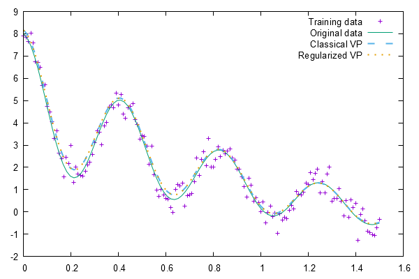
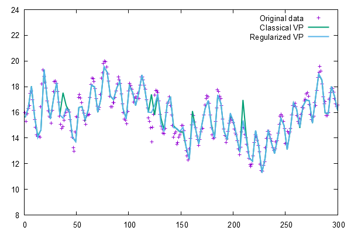

This project contains an implementation of variable projection with L1 regularization 
for separable non-linear least squares as described in: 

```Guang-Yong Chen, Min Gan, C.L. Philip Chen, Han-Xiong Li: 
A Regularized Variable Projection Algorithm for Separable 
Nonlinear Least-Squares Problems, IEEE Transactions on Automatic Control, Vol. 64, No. 2,
Feb. 2019
```

The implementation is partially based on the MATLAB implementation (varpro.m) of O'Leary and Rust (https://www.cs.umd.edu/~oleary/software/varpro/) . 

The code uses C#, runs with .NET 5 on multiple platforms and uses ALGLIB for linear algebra routines (mainly SVD).

# Building 

In the project root folder run: 
```dotnet build HEAL.VarPro.sln``` 

It generates the library ```HEAL.VarPro.dll``` as well as a demo program ```HEAL.VarPro.Demo.dll``` and the unit tests ```HEAL.VarPro.Test.dll```.

# Running the demo and the unit tests

In the project root folder run: 
```dotnet run --project .\HEAL.VarPro.Demo\HEAL.VarPro.Demo.csproj``` 

Demo output for the 'Complex Exponential Model' from (Chen et al. 2019): 
```
> dotnet run --project .\HEAL.VarPro.Demo\HEAL.VarPro.Demo.csproj
 It     C        ||r||²      ||c||²      step      lam         w                 alpha
  0 6.811e+002 6.645e+002 1.534e+001 1.00e+000 1.083e+000 9.739e-001 [8.457e-001 2.333e+000 7.476e+000]
  1 3.770e+002 3.707e+002 3.753e+001 1.00e+000 1.687e-001 9.712e-001 [1.768e+000 1.872e+000 1.114e+001]
  2 1.879e+002 1.856e+002 4.296e+001 1.00e+000 5.322e-002 9.706e-001 [2.135e+000 8.452e-001 1.341e+001]
  3 1.794e+002 1.767e+002 3.242e+001 1.00e+000 8.344e-002 9.695e-001 [5.664e-001 1.607e+000 1.409e+001]
  4 4.263e+001 4.198e+001 3.666e+001 1.00e+000 1.766e-002 9.692e-001 [9.297e-001 1.270e+000 1.509e+001]
  5 2.721e+001 2.681e+001 3.534e+001 1.00e+000 1.137e-002 9.691e-001 [1.084e+000 1.031e+000 1.500e+001]
  6 2.667e+001 2.628e+001 3.478e+001 1.00e+000 1.120e-002 9.689e-001 [1.114e+000 9.680e-001 1.501e+001]
  7 2.666e+001 2.628e+001 3.474e+001 2.38e-007 1.120e-002 9.687e-001 [1.115e+000 9.650e-001 1.501e+001]
  8 2.666e+001 2.628e+001 3.474e+001 4.77e-007 1.120e-002 9.686e-001 [1.115e+000 9.650e-001 1.501e+001]
  9 2.666e+001 2.628e+001 3.474e+001 4.77e-007 1.120e-002 9.684e-001 [1.115e+000 9.650e-001 1.501e+001]
 10 2.666e+001 2.628e+001 3.474e+001 4.77e-007 1.120e-002 9.683e-001 [1.115e+000 9.650e-001 1.501e+001]
 11 2.666e+001 2.628e+001 3.474e+001 1.86e-009 1.119e-002 9.681e-001 [1.115e+000 9.650e-001 1.501e+001]
 12 2.666e+001 2.628e+001 3.474e+001 5.96e-008 1.119e-002 9.681e-001 [1.115e+000 9.650e-001 1.501e+001]
 13 2.666e+001 2.628e+001 3.474e+001 2.38e-007 1.119e-002 9.680e-001 [1.115e+000 9.650e-001 1.501e+001]
 14 2.666e+001 2.628e+001 3.474e+001 4.77e-007 1.119e-002 9.678e-001 [1.115e+000 9.650e-001 1.501e+001]
 15 2.666e+001 2.628e+001 3.474e+001 2.38e-007 1.119e-002 9.677e-001 [1.115e+000 9.650e-001 1.501e+001]
 16 2.666e+001 2.628e+001 3.474e+001 4.77e-007 1.119e-002 9.675e-001 [1.115e+000 9.650e-001 1.501e+001]
 17 2.666e+001 2.628e+001 3.474e+001 4.77e-007 1.118e-002 9.674e-001 [1.115e+000 9.650e-001 1.501e+001]
 18 2.666e+001 2.628e+001 3.474e+001 2.38e-007 1.118e-002 9.672e-001 [1.115e+000 9.650e-001 1.501e+001]
 19 2.666e+001 2.628e+001 3.474e+001 4.77e-007 1.118e-002 9.670e-001 [1.115e+000 9.650e-001 1.501e+001]
 20 2.666e+001 2.628e+001 3.474e+001 1.19e-007 1.118e-002 9.669e-001 [1.115e+000 9.650e-001 1.501e+001]
Optimal    alpha: 1.000e+000 1.000e+000 1.500e+001
Identified alpha: 1.115e+000 9.650e-001 1.501e+001

||coeff||²        3.47431e+001
||resid_test||²   1.84658e-001
||resid_test||    4.29718e-001
MSE (test)        1.22290e-003
```

To execute all unit tests run: 
```dotnet test```

## Example output for Section III.C "Parameter Estimation of a Complex Exponential Model"
The results for 'Classical VP' differ from the results reported in the original paper (Chen et al. 2019) which is probably caused by using SVD and rank determination also for the classical VP. As a consequence the results of classical and regularized VP are more similar than reported in the paper. The effect of wGCV regularization is less extreme but visible in the Lake Erie Level example.



## Example output for Section III.A "ExpAR model for Lake Erie levels"



# Using HEAL.VarPro
```HEAL.VarPro.dll``` uses .NET Standard 2.1 and can be included in .NET and .NET Framework projects.
Copy ```HEAL.VarPro.dll``` into your project folder and add an assembly reference. Don't forget to copy the .dll to your project output folder as well.

## ALGLIB Dependency
The code uses ALGLIB Free Edition version 3.17.0 which is distributed under GPL3. The source code is available from https://www.alglib.net/.
ALGLIB Commercial Edition is distributed under license which is friendly to commercial users and can be requested from https://www.alglib.net/.

## License
HEAL.VarPro is [licensed] {LICENSE.txt} under the MIT License.

```
MIT License

Copyright (c) 2021 Gabriel Kronberger and Heuristic and Evolutionary Algorithms Laboratory

Permission is hereby granted, free of charge, to any person obtaining a copy
of this software and associated documentation files (the "Software"), to deal
in the Software without restriction, including without limitation the rights
to use, copy, modify, merge, publish, distribute, sublicense, and/or sell
copies of the Software, and to permit persons to whom the Software is
furnished to do so, subject to the following conditions:

The above copyright notice and this permission notice shall be included in all
copies or substantial portions of the Software.

THE SOFTWARE IS PROVIDED "AS IS", WITHOUT WARRANTY OF ANY KIND, EXPRESS OR
IMPLIED, INCLUDING BUT NOT LIMITED TO THE WARRANTIES OF MERCHANTABILITY,
FITNESS FOR A PARTICULAR PURPOSE AND NONINFRINGEMENT. IN NO EVENT SHALL THE
AUTHORS OR COPYRIGHT HOLDERS BE LIABLE FOR ANY CLAIM, DAMAGES OR OTHER
LIABILITY, WHETHER IN AN ACTION OF CONTRACT, TORT OR OTHERWISE, ARISING FROM,
OUT OF OR IN CONNECTION WITH THE SOFTWARE OR THE USE OR OTHER DEALINGS IN THE
SOFTWARE.
```
